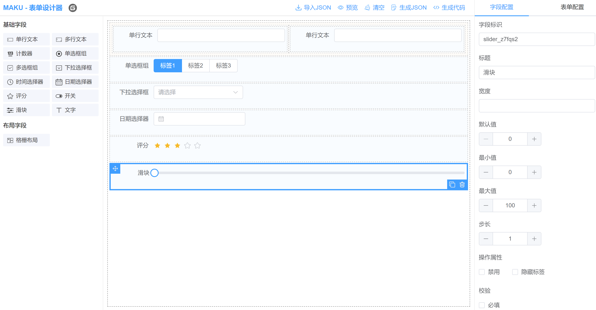
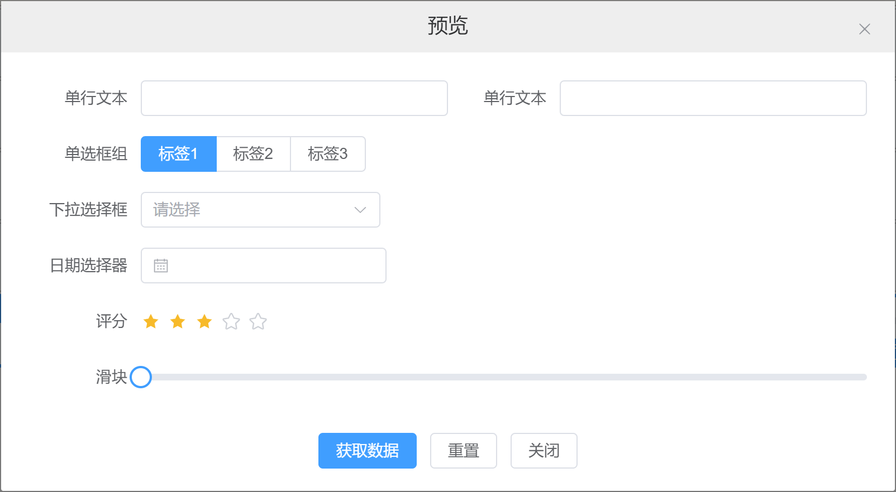
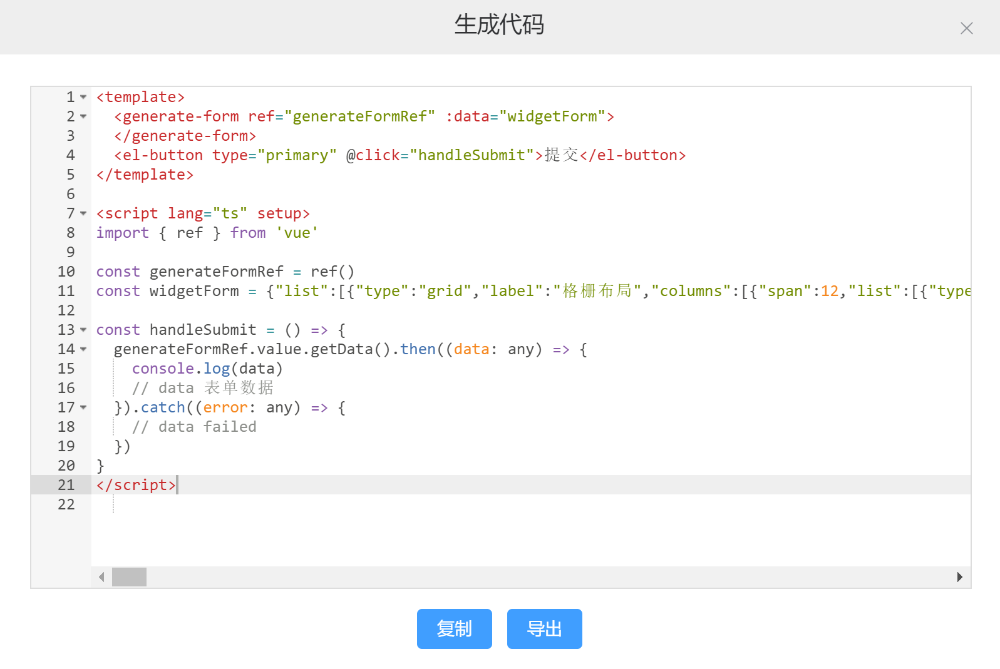

## 介绍
- MAKU 表单设计器，基于vue3、element-plus开发的表单设计器，主要用于低代码开发平台。
- 演示环境：https://demo.maku.net/maku-form-design
- 官网地址：https://maku.net

## 安装

```bash
npm install maku-form-design

# TypeScript 需要在d.ts文件里面，进行如下配置：
declare module 'maku-form-design'
```

## 效果图



